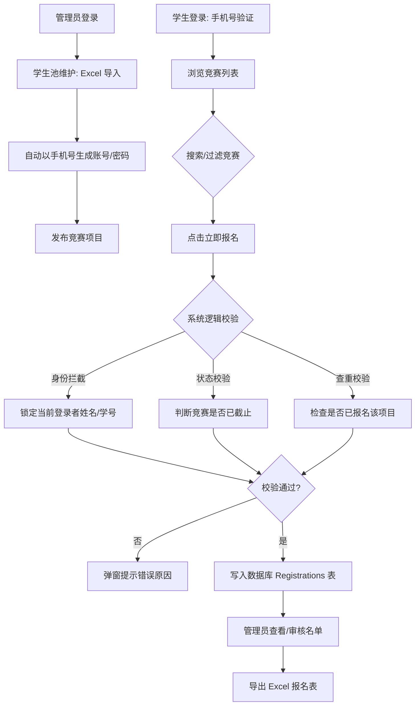

# 🏆 学校学科竞赛报名管理系统 (School Competition Management System)

> 基于 **Spring Boot 3 + Vue 3** 的现代化全栈竞赛管理平台。实现了从数据批量运维、竞赛发布到学生安全报名的完整闭环。

## 📖 项目介绍

本项目旨在解决学校竞赛报名过程中“信息录入难、身份校验弱、数据统计杂”的痛点。系统不仅支持常规的竞赛发布，更引入了 **Alibaba EasyExcel** 引擎，实现了学生账号的万级数据秒级导入。

### 核心特性

- **📊 自动化数据维护**：支持管理员一键上传学生名单，系统自动去重并生成账号；提供动态 Excel 模板下载。
- **👤 完善的账号体系**：管理员与学生均可自主维护姓名、电话及密码；系统自动以手机号作为初始凭证。
- **👥 全量账号审计 (Planned)**：支持管理员实时查看系统内所有注册用户，监控学生账号导入状态及个人资料完善程度。
- **🔒 多重安全报名机制**：防代报（锁定学号）、防重报（后端逻辑拦截），确保数据真实可靠。
- **🚀 鲁棒性网络层**：Axios 全局拦截器支持 Blob 二进制流下载与 JWT 身份令牌注入。

---

## 📁 项目结构说明

清晰的分层结构是项目可维护性的基石。

### 后端核心目录 (`com.tfgkk.schoolcompetition`)

- **`config`**: 存放全局配置类，如 `CorsConfig`（跨域配置）。
- **`controller`**: RESTful 风格的 API 接口层，包括 `UserController`（处理 Excel 导入与用户维护）、`AuthController`（处理登录）等。
- **`entity`**: 数据库实体类，通过 JPA 注解实现自动建表，并集成 EasyExcel 的 `@ExcelProperty` 注解。
- **`repository`**: 基于 Spring Data JPA 的数据访问层，定义了如 `findByUsername` 等自动生成的查询方法。

### 前端核心目录 (`school-competition-web`)

- **`src/api`**: 统一管理 Axios 请求，按业务模块（如 `competition.js`）划分接口。
- **`src/view`**: 核心业务页面，如 `AdminView.vue`（管理员后台）和 `StudentView.vue`（学生竞赛列表）。
- **`src/utils`**: 通用工具函数，包括 `request.js`（Axios 拦截器配置）和 `excel.js`（导出逻辑）。

---

## ⚠️ CORS 跨域避坑指南

在前后端分离开发中，跨域报错（CORS error）是新手最容易遇到的“拦路虎”。

### 1. 为什么会跨域？

由于前端在 `5173` 端口，后端在 `8080` 端口，浏览器出于安全策略会拦截非同源请求，特别是带有 `Authorization` 自定义 Header 的请求。

### 2. 解决方案：全局配置类

不要在 Controller 上逐个添加 `@CrossOrigin`。建议使用全局配置，因为它优先级更高且支持更精细的控制：

```java
@Configuration
public class CorsConfig implements WebMvcConfigurer {
    @Override
    public void addCorsMappings(CorsRegistry registry) {
        registry.addMapping("/**") // 对所有接口生效
                .allowedOriginPatterns("*") // 允许所有来源
                .allowedMethods("GET", "POST", "PUT", "DELETE", "OPTIONS") // 允许 OPTIONS 预检请求
                .allowedHeaders("*")
                .allowCredentials(true);
    }
}

```

### 3. 注意事项

- **预检请求 (Preflight)**：浏览器会先发送一个 `OPTIONS` 请求。如果后端未正确响应 `OPTIONS`，实际请求将无法发出。
- **响应体解析**：如果前端拦截器对响应体进行了 `.code === 200` 校验，务必确保下载文件（Blob）等特殊响应类型能直接通过拦截器。

---

## 🛠️ 技术栈

- **后端**: Spring Boot 3, Spring Data JPA, MySQL 8, **Alibaba EasyExcel**.
- **前端**: Vue 3 (Composition API), Vite, Pinia, Axios, Lucide Icons.

## 👨‍💻 作者

- **Developer**: [tfgkk]
- **Project**: 个人全栈练习项目 / 课程设计

---

**✨ 如果这个项目对你有帮助，欢迎点个 Star 鼓励一下！**
---

## 🔄 业务逻辑流程图 (Business Logic Flowchart)

本项目核心业务流程涵盖了从管理员初始化数据到学生报名的完整路径，通过 **Mermaid** 语法呈现如下：



---

## 🛡️ 项目亮点补全：核心业务逻辑说明

除了流程图，我们在代码层面也落实了以下关键逻辑，确保系统在实际使用中的健壮性：

1. **Excel 导入防重逻辑**：在 `UserController` 导入学生时，系统会优先根据 `phone`（即 `username`）在数据库检索，仅当用户不存在时才执行 `save` 操作，有效避免了数据冲突。
2. **报名身份锁定（防代报）**：在 `StudentView` 的报名弹窗中，姓名和学号字段被设为 `disabled`（只读），且数据直接从 `Pinia` 状态管理仓库中读取，确保报名信息与登录账号严格一致。
3. **竞赛状态联动**：前端根据 `status` 字段动态渲染按钮状态（立即报名/已截止），后端在保存报名记录前会再次校验当前时间是否在竞赛起止范围内。
4. **Axios 全局拦截**：针对 404（路径不存在）、401（未授权）和 500（服务器异常）提供了统一的 UI 弹窗反馈，极大提升了用户体验。
